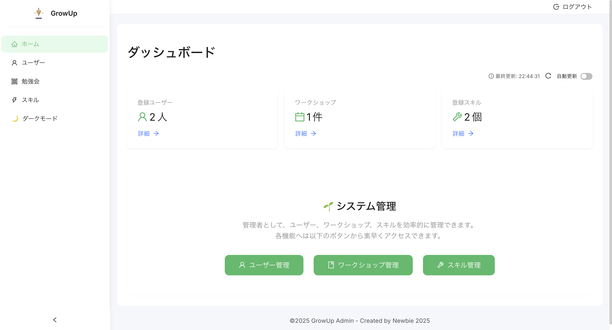
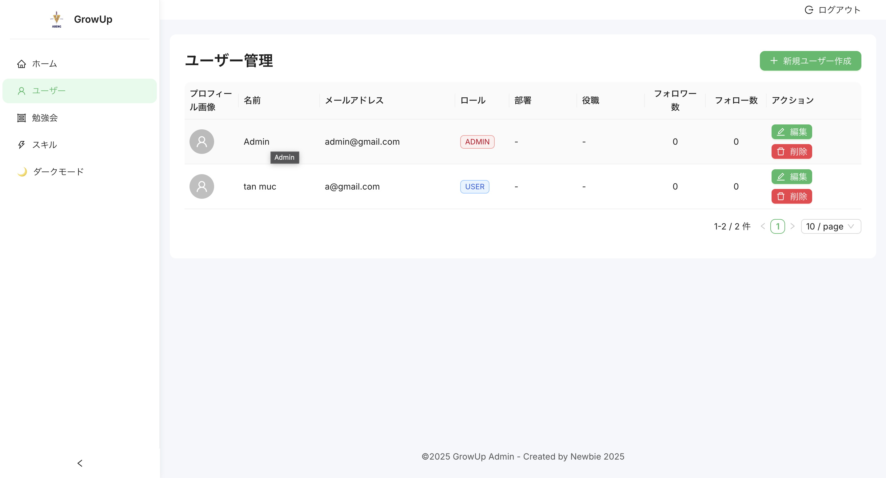
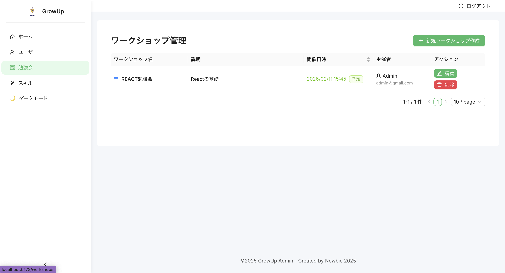
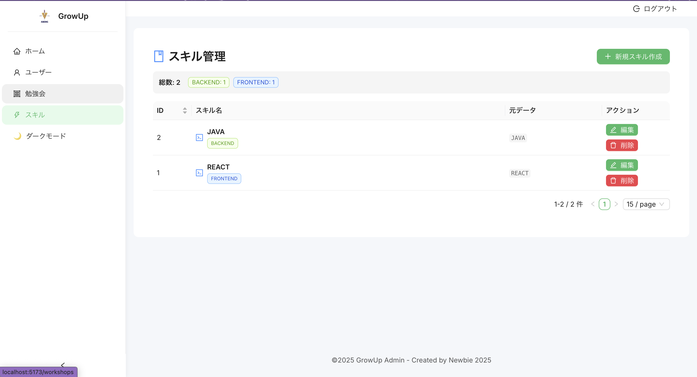

# Grow Up Admin

このプロジェクトは、ユーザー、スキル、およびワークショップを管理するためのシンプルな管理画面アプリケーションです。
React と Ant Design を使用して構築されています。

## 主な機能

- **ダッシュボード**: システム全体の統計情報を確認できます。
- **ユーザー管理**: ユーザーの追加、編集、削除が可能です。
- **スキル管理**: スキルの登録や編集を行えます。
- **ワークショップ管理**: ワークショップ情報の管理ができます。

## 使用技術

- **Frontend**: React, Vite
- **UI Library**: Ant Design
- **Routing**: React Router
- **HTTP Client**: Axios

## 開発環境のセットアップ

以下のコマンドを実行して、プロジェクトをローカル環境で起動してください。

```bash
# 依存関係のインストール
npm install

# 開発サーバーの起動
npm run dev
```

ブラウザで `http://localhost:5173` (またはコンソールに表示されるURL) にアクセスして確認してください。

## 画面一覧:





